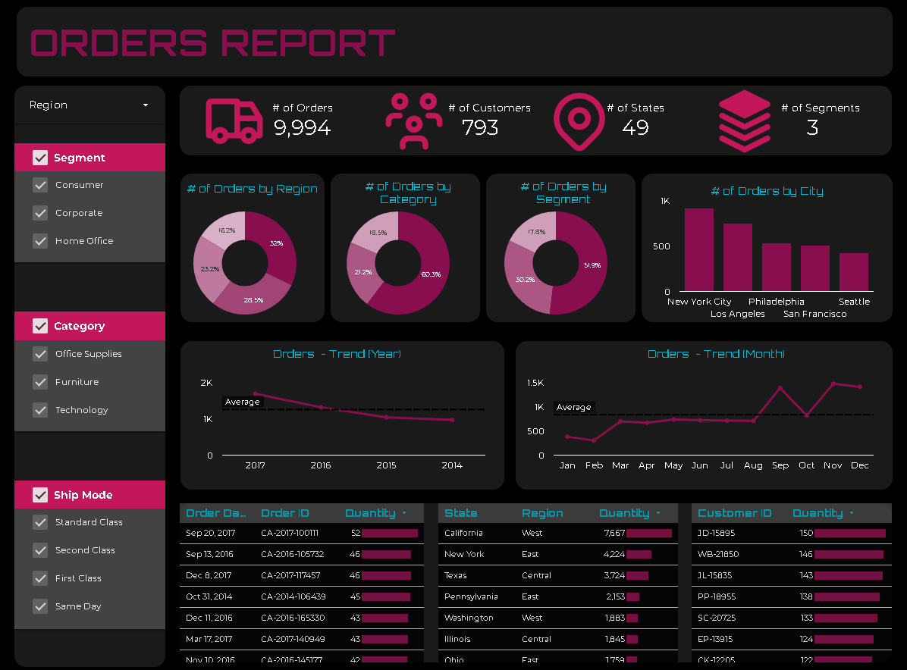

# Supply-Chain-Order-Trends-Dashboard 📊  

An interactive Looker dashboard designed to analyze and monitor Supply Chain Management (SCM) order trends. The dashboard provides real-time insights into **order volume, shipment mode trends, and top-performing states**, enhancing logistics efficiency and customer behavior analysis.

## 🚀 Features  
- **Order Analytics:** Analyzed 9,994 orders across regions, categories, and segments.  
- **Shipment Trends:** Identified preferred shipment modes for different segments.  
- **Top-Performing States:** Highlighted states contributing the most to order volume.  
- **Real-Time Insights:** Monitored customer behavior and logistics efficiency dynamically.  
  
## 🛠 Tech Stack  
- **Looker Studio** - Interactive data visualization  
- **SQL** - Data querying and transformation  
- **Supply Chain Analytics** - Data-driven supply chain insights  

## 📷 Dashboard Preview  
  

## 📌 Use Cases
- **Track Order Trends:** Identify fluctuations in order volume across different months and years.
- **Analyze Shipment Preferences:** Optimize logistics based on shipment mode popularity.
- **Regional & Segment Performance:** Gain insights into top-performing states, cities, and customer segments.
- **Improve Supply Chain Efficiency:** Make data-driven decisions to streamline order fulfillment.
